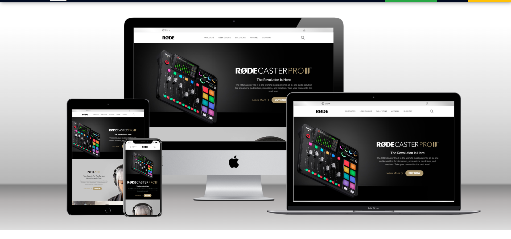

## ⭐ Rode.com Clone ⭐

This is an assignment given in **"JavaScript Full Stack Web Developer Bootcamp"** by **iNeuron**, built using **HTML5, CSS3 and Tailwind CSS**.

⭕ **This Site is Fully Responsive**
 
 

## 📌 **Live Site URL:** <a href="https://navdeep-rode-clone.netlify.app/">**Visit Now** 🚀</a>

 

## 📌 Tech Stack

&nbsp;
 
 

## 📌 Overview

 

## 📌 My process

- I joined a bootcamp **"JavaScript Full Stack Web Developer Bootcamp"** by **iNeuron**.<a href="https://ineuron.ai/"> **Check🚀 (Not Sponsered)**</a>
- This project is given to us as an assignment.
- After completing shopify clone for about **14 hours** started developing this rode clone.
- It took me about **13 hours** to complete this project.
- During this **13 hours** process learned about the new CSS framework i.e. Tailwind CSS.

## 📌 What I Learn

👉 Learn how to code for long hours.
👉 Learn how to add icon in title of webpage
👉 Learn how to show different div tags based on mobile width  
👉 Learn hover css using Tailwind and apply it to the button.  
👉 Learn mobile-first design using CSS.  
👉 How to develop full fledge landing page.  
👉 Learn to plan such a huge project.  
👉 Learn how to build fluid layouts using FlexBox.

## 📬 Connect With Me

- **LinkedIn** - [Navdeep Singh](https://www.linkedin.com/in/navdeep-singh-a9112313b/)

## 📌 Acknowledgments

- Course Instructor - [Hitesh Choudhary](https://github.com/hiteshchoudhary)
- Icons Used For Tech Stack Section - [https://img.shields.io](https://img.shields.io)

