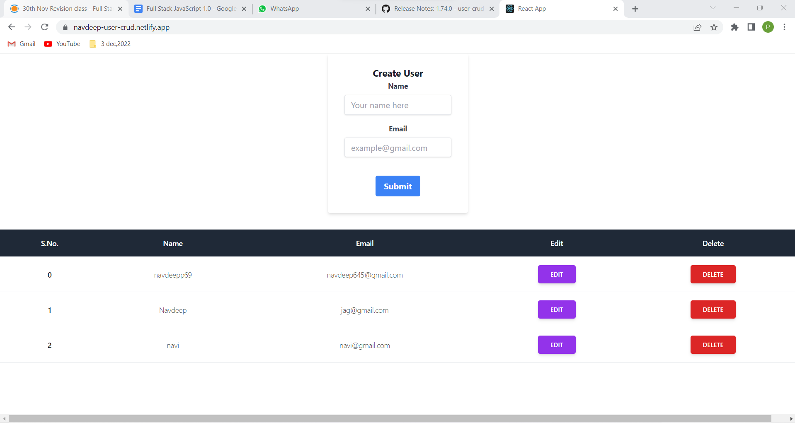
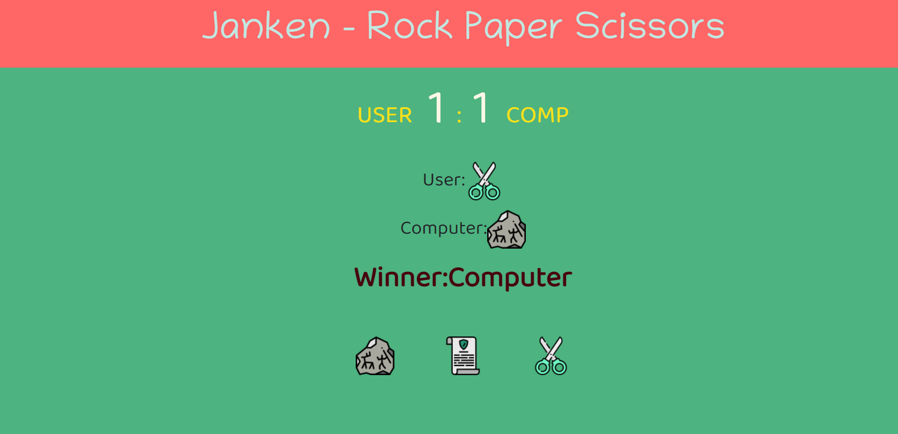
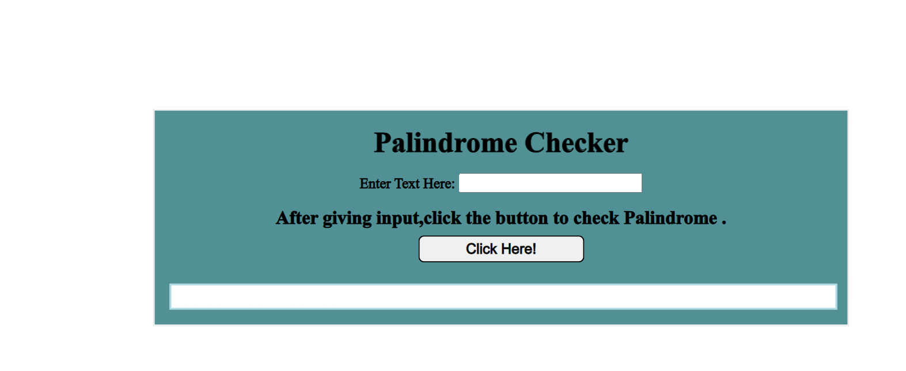
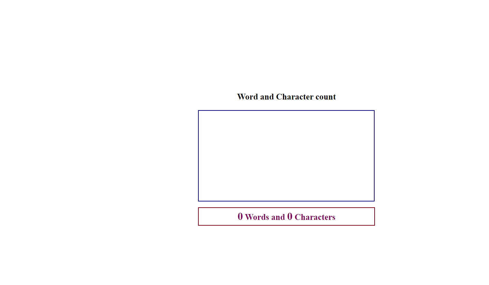
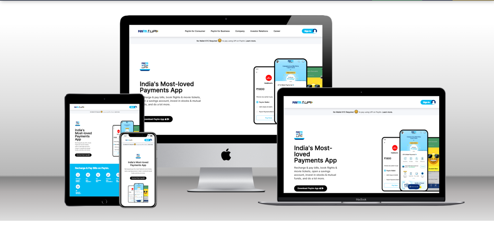

# Hi 
##  I am <strong>Navdeep Singh </strong>

## !!! Welcome to my repository!!!
 

### My Introduction -

>  I am currently working as a frontend developer at Tata Consultancy Services Ltd.I have 2 years of work Experience

> You can check my [LinkedIn Profile](https://www.linkedin.com/in/navdeep-singh-a9112313b/) 

> [my portfolio](https://navdeep-portfolio.netlify.app/) and [my Blogs](https://navdeep167.hashnode.dev/)

 

### My Teck stack includes 

 > - HTML 5 
> - CSS 
> - Tailwind CSS
> - Javascript
> -  React js 
> -  Node js
> - Express js
> - MongoDB

 

## Kindly  go through all the branches of this repository to view my projects
 

> ###  Some Highlighted Branches are as below :

 

##  <strong>Full Stack Javacript Projects</strong> 

### Technology Stack used-
> ###  HTML, CSS ,Tailwind CSS,  Javascript , React js, Node js, Express js, MongoDB

 

### <em><strong> User CRUD operations Application</strong></em>
 

[Git Repo Link](https://github.com/NavdeepSingh16-98/iNeuronFulllStackJavascriptAssignments/tree/user-crud)
 
[Live Link](https://navdeep-user-crud.netlify.app/)

 

##  <strong>Javacript Projects</strong> 

 

### <em><strong> Rock Paper Scissor Game</em>
 

[Link](https://github.com/NavdeepSingh16-98/iNeuronFulllStackJavascriptAssignments/tree/rock-paper-scissor)

 

###   <em><strong>Palindrome Checker</strong></em>

<strong>[Link](https://github.com/NavdeepSingh16-98/iNeuronFulllStackJavascriptAssignments/tree/palindrome)

 

### <em><strong> Word and Character Counter</strong></em>

[Link](https://github.com/NavdeepSingh16-98/iNeuronFulllStackJavascriptAssignments/tree/wordcount)

 
 

## <strong> HTML, CSS and Tailwind CSS Projects</strong>

 

### <em><strong> Paytm Clone</strong></em>

[Link](https://github.com/NavdeepSingh16-98/iNeuronFulllStackJavascriptAssignments/tree/paytm-clone)

 

### <em><strong> Shopify Clone </strong></em>

[Link](https://github.com/NavdeepSingh16-98/iNeuronFulllStackJavascriptAssignments/tree/shopify-clone)

 

### <em><strong> Rode Clone </strong></em>

[Link](https://github.com/NavdeepSingh16-98/iNeuronFulllStackJavascriptAssignments/tree/rode-clone)

 

## <strong>Remaining HTML and CSS (mobile responsive websites) links -</strong> 

[Project 1](https://github.com/NavdeepSingh16-98/iNeuronFulllStackJavascriptAssignments/tree/project1)

[Project 2](https://github.com/NavdeepSingh16-98/iNeuronFulllStackJavascriptAssignments/tree/project2)

[Project 3](https://github.com/NavdeepSingh16-98/iNeuronFulllStackJavascriptAssignments/tree/project3)

[Project 4](https://github.com/NavdeepSingh16-98/iNeuronFulllStackJavascriptAssignments/tree/project4)

[Project 5](https://github.com/NavdeepSingh16-98/iNeuronFulllStackJavascriptAssignments/tree/project5)

[Project 6](https://github.com/NavdeepSingh16-98/iNeuronFulllStackJavascriptAssignments/tree/project6)

[Project 7](https://github.com/NavdeepSingh16-98/iNeuronFulllStackJavascriptAssignments/tree/project7)

[Project 8](https://github.com/NavdeepSingh16-98/iNeuronFulllStackJavascriptAssignments/tree/project8)

[Project 9](https://github.com/NavdeepSingh16-98/iNeuronFulllStackJavascriptAssignments/tree/project9)

[Project 10](https://github.com/NavdeepSingh16-98/iNeuronFulllStackJavascriptAssignments/tree/project10)

[Project 11](https://github.com/NavdeepSingh16-98/iNeuronFulllStackJavascriptAssignments/tree/project11)

[Project 12](https://github.com/NavdeepSingh16-98/iNeuronFulllStackJavascriptAssignments/tree/project12)

[Project 13](https://github.com/NavdeepSingh16-98/iNeuronFulllStackJavascriptAssignments/tree/project13)

[Project 14](https://github.com/NavdeepSingh16-98/iNeuronFulllStackJavascriptAssignments/tree/project14)

[Project 15](https://github.com/NavdeepSingh16-98/iNeuronFulllStackJavascriptAssignments/tree/project15)

> ### Keep viewing this repository for more updates as I will keep pushing the code

## <em> !! Thanks For Viewing !! </em>
