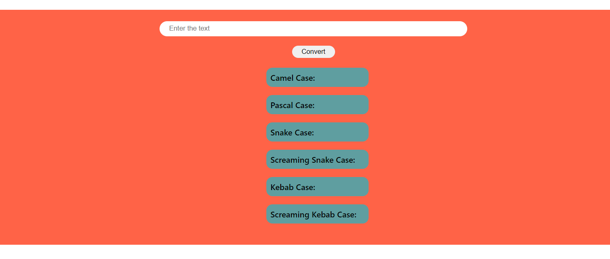

# QR code generator

## Navdeep Singh

### Enter the test for which you want to generate QR code, the click on 'Generate' button, QR code will appear below

#### My Learnings-

- Basics of HTML, CSS and Javascript
- Basics of API integration and API calling
- Using QR code API

[Live Link](https://navdeep-qr-converter.netlify.app/)

