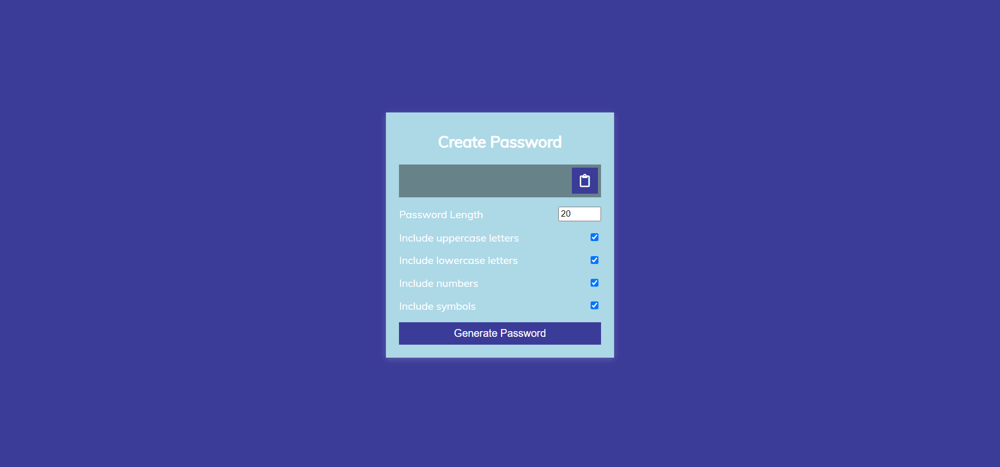

# Random Password Generator

## Navdeep Singh

### This is a random password generator developed using HTML, CSS and Javascript

### While Developing it I learned -

- Basics of HTML and CSS
- Advanced Javascript like addeventListener, copying text from clipoard etc.

[Live Link](https://navdeep-password-generator.netlify.app/)

