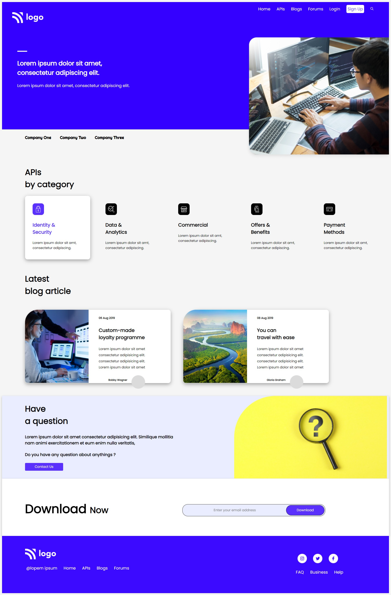

# Developer Landing Page

## Navdeep Singh

### I Learnt to create full length beatiful web page called Developers Landing Page template. HTML, CSS, CSS Selector, Flexbox, Positions, media queries and SVGs are the main concepts of the project I covered in this project. I also learn't how to push my code to github, though I know it before but the new thing I learnt to make my Github project Live.

### This webpage is mobile responsive too

Live Link :point_down:

[Project9](https://navdeep-project9.netlify.app/)

