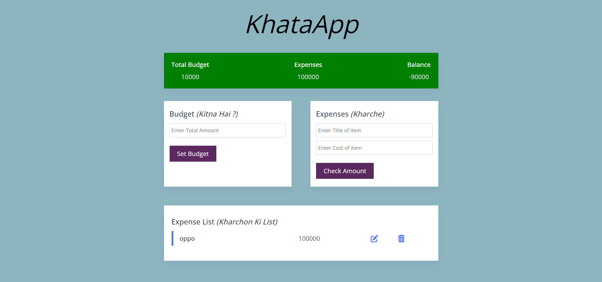

# Bill Splitter

## Navdeep Singh

### While Making this bill Splitter, I learned -

- Basics of html
- Basics of javascript
- CSS media queries

### Challenges I faced -

- To write the logic of the code
- To architect the application according to needs

#### Preview of the application is as follows -

