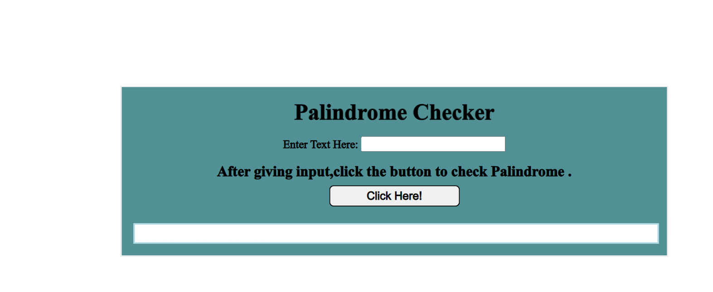

# Palindrome Checker
## Navdeep Singh

### While developing this project I learnt the following

- Basics of HTML, CSS and Javascript
- Javascript function like replace, split etc.

[Live Link]('https://navdeep-palindrome.netlify.app')