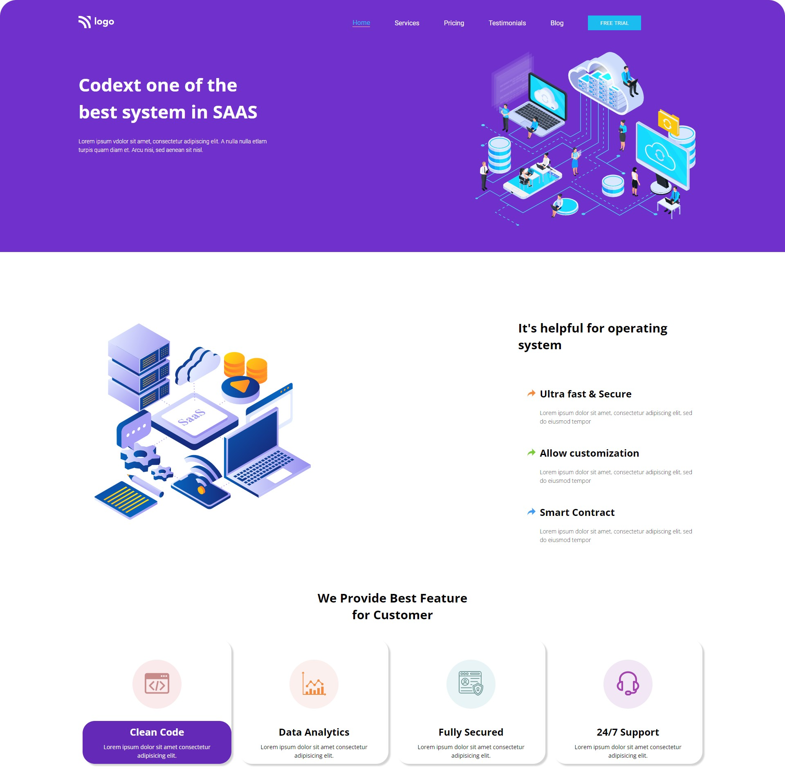

# SAAS Landing Page

## Navdeep Singh

### In this project, I learnt following-

- CSS Flexbox
- Various CSS properties like border-radius, linear-gradient etc.
- CSS media queries

### This webpage is mobile responsive too

Live Link :point_down:

[Project13](https://navdeep-project13.netlify.app/)
