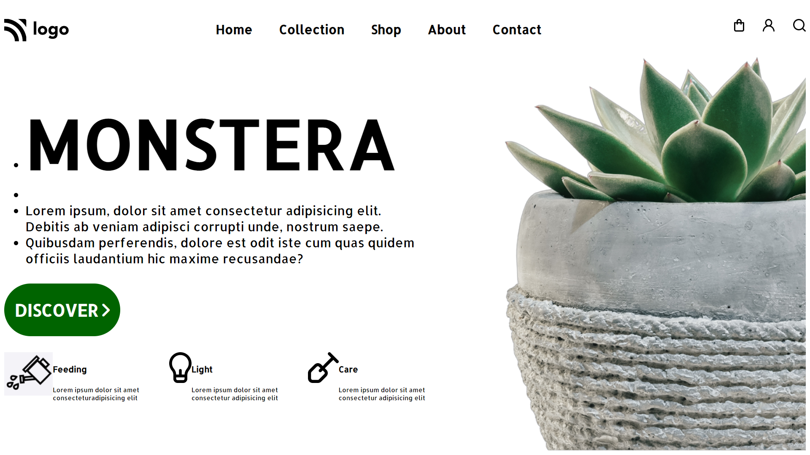

# Plant Home Page

## Navdeep Singh

### In this project , I learned to use CSS flexbox, align items in div as per given wireframe

Live Link :point_down:

[Project6](https://navdeep-project6.netlify.app/ "Project6")