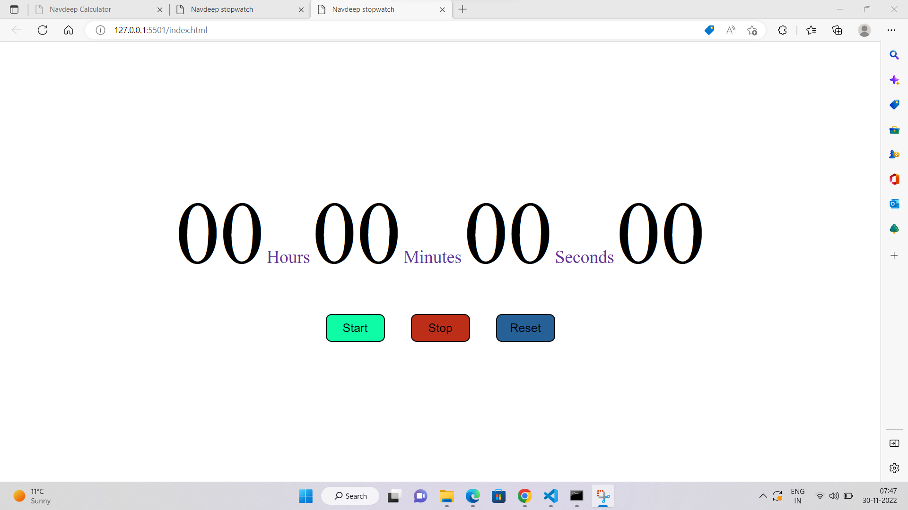

# Stopwatch

## Navdeep Singh

### While making this project I learned -

- Basics of HTML, CSS and Javascript

- adding event listeners in javscript

[Live Link](https://navdeep-stopwatch.netlify.app)
